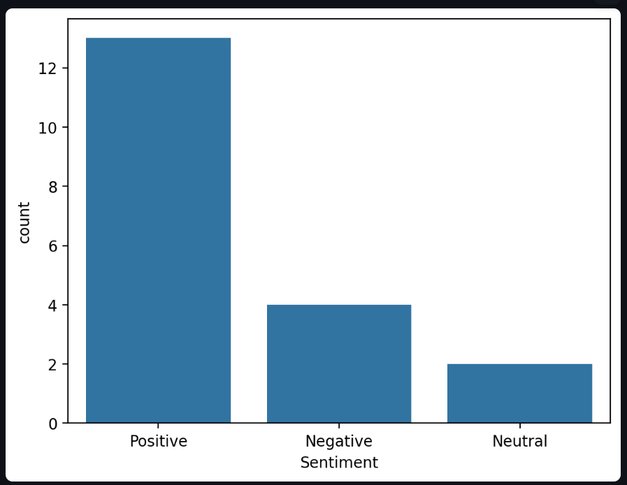
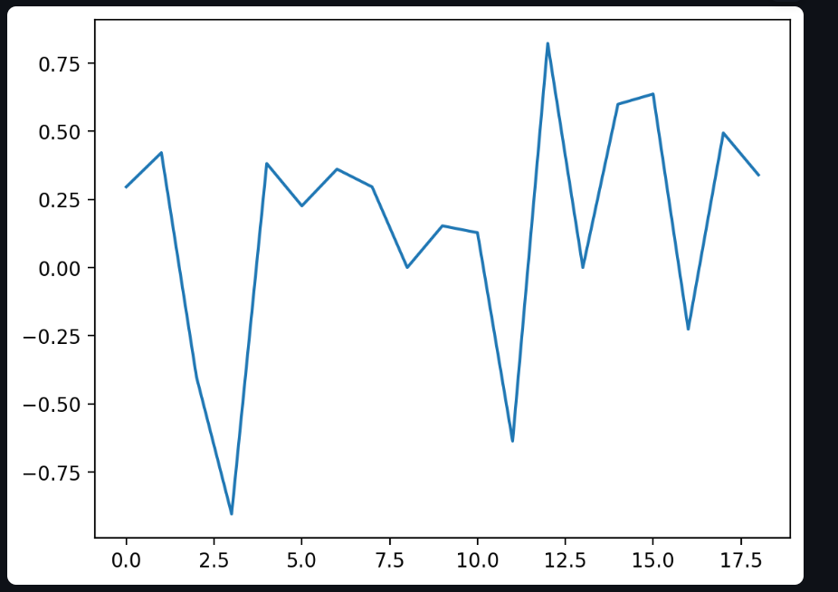

#  Real-Time Sentiment Analysis Dashboard

A real-time web-based sentiment analysis dashboard built using **Python and Streamlit** that analyzes live news articles for any stock or brand and classifies sentiment using NLP.

---

##  Live Demo
 https://sentiment-dashboard-ig5xmfw3r6hhratvughmbm.streamlit.app/

---

##  Project Overview

This project collects real-time news articles using NewsAPI and performs sentiment analysis using VADER (NLTK-based sentiment model). It then visualizes insights through an interactive Streamlit dashboard.

It helps understand market perception of companies like:
- Tesla
- Apple
- Google
- TCS
- Nvidia



---

##  Features

- Real-time news data extraction
- NLP-based sentiment classification (Positive / Negative / Neutral)
- Interactive dashboard using Streamlit
- Sentiment distribution charts
- Trend visualization of sentiment scores
- Works for any stock or brand keyword

---

## Tech Stack

- Python 
- Streamlit
- Pandas
- Matplotlib
- Seaborn
- VADER Sentiment Analysis
- NewsAPI

---


##  Installation & Setup

### 1. Clone the repository

git clone https://github.com/your-username/sentiment-dashboard.git
cd sentiment-dashboard

2. Install dependencies
pip install -r requirements.txt

3. Add NewsAPI Key

Create a .streamlit/secrets.toml file:

NEWS_API_KEY = "your_api_key_here"

4. Run the application
streamlit run app.py

Example Output
     Sentiment distribution (bar/pie chart)
     Sentiment score trend line
     Live news table with classification


Use Cases
     Stock market sentiment tracking
     Brand reputation analysis
     NLP learning project
     Data science portfolio project
     Freelancing/Fiverr service demo

Author

Brishti Maitra
QA Engineer

If you like this project, Give it a star on GitHub ⭐
```


